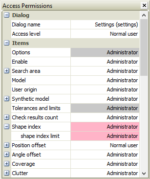

Permissions update
==================

Overview
--------

The permission settings are saved in a database. It may happen that the DB used is not updated, that is, it does not contain all the items of parameters or windows.

If the DB is not updated, the missing items are displayed in red in the permissions window.

Red parameters are not in database

To update the database, access the Users menu and press the button Update Permissions.

	Tools > Users > Update Permissions

A confirmation window will appear. Press ok to continue.

If the DB file does not exist, the permissions window will appear disabled.

In this case no permit will be applied and all users will see all settings parameters and all dialogs.

The file is supplied together with the PROINSPECT software.

Configuration
-------------

| Variable | Value | Description |
| --- | --- | --- |
| Paths\PermissionsUIS | String | The full path name of the permission file |

