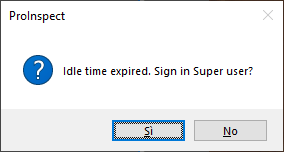
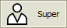

Users
=====

Overview
--------

Access to PROINSPECT features is regulated by authorization levels. Each user is assigned a level that allows access to interface elements an features. Each user can define the application layout that will be retrieved when logged in.

There are 4 authorization levels. Here are listed levels from higher to lower:

| | | |
| - | - | - |
| 1 | Administrator | Reserved for system installer |
| 2 | Super | Assigned to the system manager |
| 3 | Leader | Assigned to privileged system operator |
| 4 | Operator | Assigned to the machine operator |

You can have any number of users with its authorization level.

The Administrator user has access to all PROINSPECT features and has the right to define access permissions for users of other levels.

PROINSPECT can only be closed by authorized users.

Forced user
-----------

When closing PROINSPECT the name of the current user is saved. When PROINSPECT restarts the saved current is logged in. If you want a specific user to be logged in when PROINSPECT starts you must enter a valid name in the registry variable ForcedUser.

It is possible to change the current user to the forced user after a time of user inactivity by setting the registry variable ForcedUserIdleTime.

User switching occurs automatically if the current user has an authorization level higher than ForcedUserConfirmationLevel. Otherwise a confirmation window appears

Change user confirmation window

If you want the user change to be notified in the message window and in the logs, the registry variable ForcedUserNotification is set to 1.

Application exit
----------------

PROINSPECT can only be closed by authorized users, i.e. with a level equal to or greater than UserCloseMode.

Change user
-----------

The change user window is accessed via the Users menu.

	Tools > Users > Change User…

Alternatively, you can access it by pressing the users button in the right corner of the status bar. The current user name is showed in this button.

Select the desired user. Enter your password. Press Ok.

Configuration

Users are configured in the registry.

| Variable | Value | Description |
| --- | --- | --- |
| Users\NumUsers | Positive integer | Number of users |
| Users\User<n>\Group | 1, 2, 3, 4 | Authorization level |
| Users\User<n>\Name | String | User name |
| Users\User<n>\Password | String | User password |
| Users\ForcedUser | String | Name of user to load at Startup |
| Users\ForcedUserIdleTime | | 0 | Disabled | | --- | --- | | Positive integer | Minutes | | Idle time before loading ForcedUser |
| Users\ForcedUserConfirmationLevel = <1,2,..,N> | Users values | Name of user to load at Startup |
| Users\ForcedUserNotification = <0,1> | 0, 1 | Notifies that ForcedUser has been loaded |
| Users\UserCloseMode | Users values | Enable Exit button |

