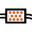
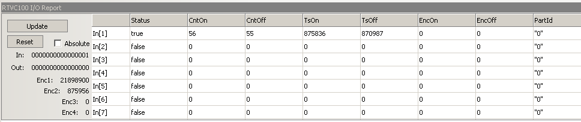
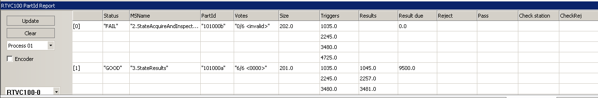
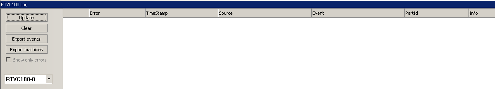
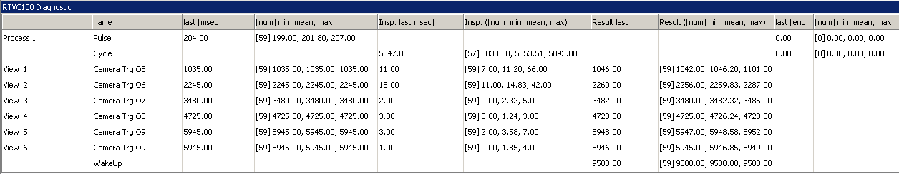
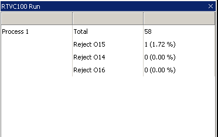
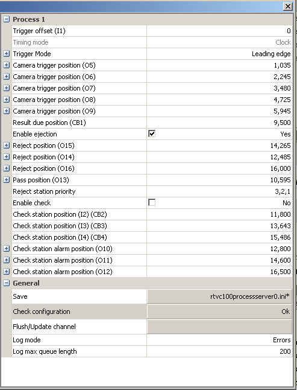

CPRTVC100
=========

Overview
--------

CPRTVC100 plugin is used as front end for RTVC100ServerService.  
No extra registry configuration is required for single VC100 or VC200 device

This is composed by five report panels:

1. I/O Report
2. Part-ID Report
3. Log
4. Diagnostic
5. Run

and one general setting:

1. VC100 general settings

IO Report Usage:
----------------

Update is available in order to refresh data from device. This panel cannot be auto updated.

Each row depicts state of input or output line, time and encoder position if enabled.   
Line is tagged by PartId code only if executed by scheduler or engaged as First Station.

PartID Report
-------------

Update is available in order to refresh data from device. This panel cannot be auto updated.  
Device and Process can be selected using combo box on left panel side. 

This table is used to extract item information during tracking station process.   
Major information is time based because of execution time inspection check. 

Log Report
----------

Update is available in order to refresh data from device. This panel cannot be auto updated.  
Device can be selected using combo box on left panel side. 

This report is used to display log info from service. Panel can export event list to cvs file format.

Diagnostic Report
-----------------

This panel is auto updated.  
This report is used to display statistics info from service. 

Each row depicts relative signal execution in time (min, mean, max) according to last samples collected. Max number of samples is limited to 1024.

Here is a list of major point of reference:

| Process <x> | First Station pulse duration on and cycle time. | Pulse duration range tests trigger sensor accuracy. Cycle time is used to check max elapsed time for vision inspection. |
| --- | --- | --- |
| View <x> | Camera trigger position, inspection time, “setResult” time position. | Max inspection time value should be less than min Cycle time. Result position must be less than WakeUp time position |
| WakeUp | First station relative wakeup execution. | This position has to balance inspection time and camera execution. Wakeup must be prior each handling event. |
| Reject <n> | First station relative handling execution. | Manual tuning is need to verify handling execution |
| Check station | Time delay from Input check line signal. | Check station should be inside Pulse duration signal range. Check presence is made by a single point of detection. |

Run Report
----------

This panel is auto updated.  
This report is used to display line counting info per process. 

Settings
--------

Settings can be changed online from this interface.   
When configuration meets your needed, you can save it into configuration file pressing Save button.

A Check configuration is made every time you change a time/encoder parameter.

This settings panel is designed only for advanced administrator users.  
